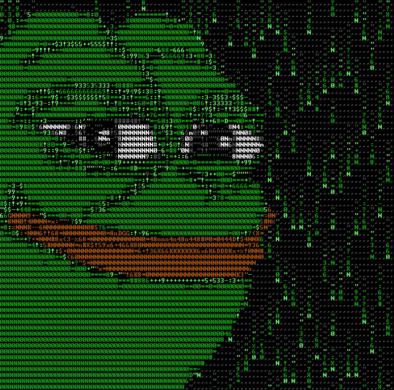

<!-- https://readme-typing-svg.demolab.com/demo/?size=30&duration=4000&color=1ACD00&lines=Hello+I%27m+Gihoon -->

---

### _Platforms & Language_

<!--

-->

### _Tools_

### BOJ

<!--
[ 방문자 수 확인 ]
https://hits.seeyoufarm.com/

[ 로고 만들기 ]
https://simpleicons.org/

[ 뱃지 생성하기 ]
https://shields.io/
-->
